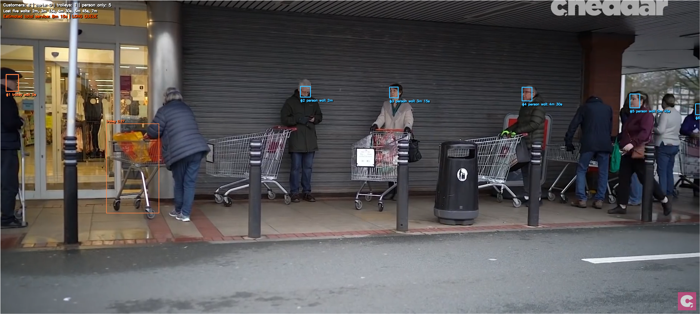
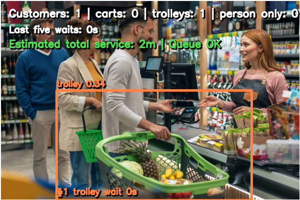

# Supermarket Queue Monitor

Computer-vision project for detecting supermarket queues and estimating waiting time from images or videos. The model detects three classes: person, shopping basket, and shopping trolley. A post-processing script links nearby baskets/trolleys to people, orders customers inside a region of interest, and exports annotated media plus CSV queue estimates.

## Highlights

- Fine-tuned YOLO model for queue scenes with people, baskets, and trolleys.
- CLI pipeline for images and videos using OpenCV and Ultralytics.
- Region-of-interest support for focusing on checkout lanes.
- Queue analytics including customer count, basket/trolley count, estimated total service time, last-customer wait, and warning state.
- Includes training charts, confusion matrix, sample outputs, and a cleaned training notebook.

## Results

Best validation checkpoint:

| Metric | Value |
| --- | ---: |
| Precision | 0.879 |
| Recall | 0.640 |
| mAP50 | 0.727 |
| mAP50-95 | 0.523 |

Class-level validation from the best model:

| Class | Precision | Recall | mAP50 | mAP50-95 |
| --- | ---: | ---: | ---: | ---: |
| person | 0.900 | 0.664 | 0.760 | 0.425 |
| shopping_basket | 0.819 | 0.333 | 0.463 | 0.355 |
| shopping_trolley | 0.917 | 0.923 | 0.957 | 0.788 |

## Sample Outputs

| Real queue | Trolley queue |
| --- | --- |
|  |  |

Failure analysis is included in [sample_outputs/failure_person_missed.png](sample_outputs/failure_person_missed.png) to show a known case where a person can be missed in a crowded scene.

## Repository Structure

```text
code/
  supermarket_queue_monitor.py      Inference and queue-estimation CLI
model/
  best.pt                           Fine-tuned YOLO checkpoint
notebooks/
  final_finetune_notebook.ipynb     Cleaned training notebook
results/
  confusion_matrix.png
  dataset_labels.jpg
  results.csv
  training_curves.png
sample_outputs/
  Annotated example outputs
AI_Project_Report.docx
```

## Setup

```bash
python -m venv .venv
.venv\\Scripts\\activate
pip install -r requirements.txt
```

For GPU inference, install the PyTorch build that matches your CUDA version from the official PyTorch instructions.

## Usage

Run on one image, video, or a folder of media:

```bash
python code/supermarket_queue_monitor.py ^
  --model model/best.pt ^
  --source path/to/input_or_folder ^
  --output-dir outputs ^
  --front top ^
  --warning-count 6
```

Optional controls:

- `--roi x1,y1,x2,y2` accepts absolute pixels or normalized values from 0 to 1.
- `--front top|bottom|left|right` controls queue ordering direction.
- `--basket-seconds`, `--trolley-seconds`, and `--unknown-seconds` tune service-time estimates.
- `--frame-stride` skips frames for faster video processing.

The script writes annotated media and `queue_estimates.csv` to the output directory.

## Notes

The training notebook references the dataset source used during model development. Dataset files are not included because they are large; this repository keeps the trained checkpoint, evaluation artifacts, and runnable inference pipeline.

## Author

Muhammad Faizan Ali
